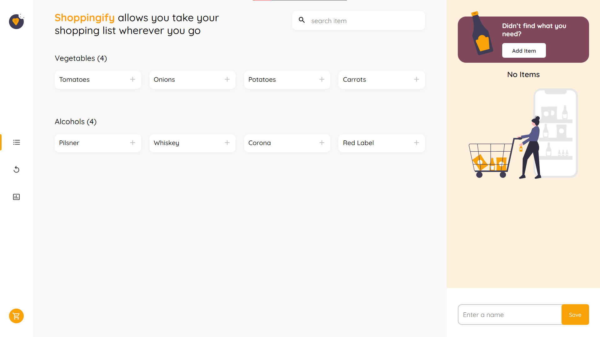

<h1 align="center">Shoppingify</h1>

<div align="center">
   Solution for a challenge from  <a href="http://devchallenges.io" target="_blank">Devchallenges.io</a>.
</div>

---

## shopping list management with statistics and history module

## Table of Contents

- [Overview](#overview)
- [Tech Stack](#tech-stack)
- [How to use](#how-to-use)
- [Author](#author)

## Overview




## Tech Stack

- React
- Next.js
- TypeScript
- Styled Components
- Material UI
- Framer Motion
- Recharts
- Redux
- Prisma ORM
- Mongodb

## How to use

#### To clone and run this application, you'll need [Git](https://git-scm.com/) and [Node.js](https://nodejs.org/en/download/) (which comes with [npm](http://npmjs.com/)) installed on your computer. From your command line:

```powershell
# Clone This repository
git clone https://github.com/Jocanm/shoppingify

#Install dependencies
npm install 

#Run the app in development mode
npm run dev
```

#### You will also need to fill in the environment variables, the ones needed to run the application correctly.

```powershell
#mongo connection url string
DATABASE_URL= 

# Github keys for oauth authentication
GITHUB_CLIENT_ID=
GITHUB_CLIENT_SECRET=

# Google keys for oauth authentication
GOOGLE_CLIENT_ID=
GOOGLE_CLIENT_SECRET=

# Secret key for jsonwebtoken generation
NEXTAUTH_SECRET=
```

## Author
---

- Frontend Mentor - [@Jocanm](https://devchallenges.io/portfolio/Jocanm)